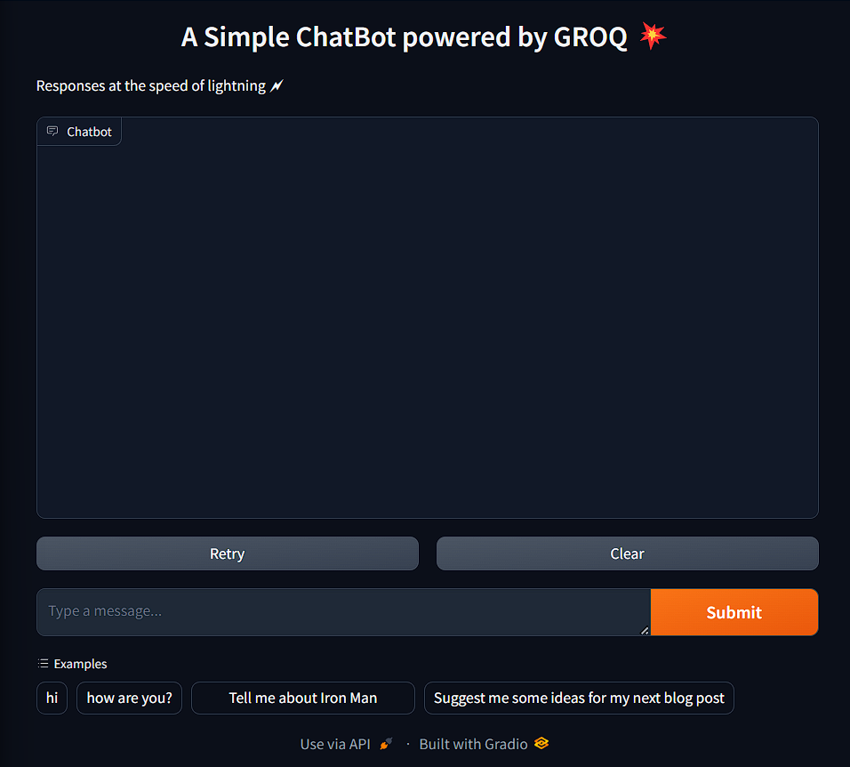

# Fast Chatbot using GROQ API

## Hey there folkss! 👋

Welcome to my fast and efficient chatbot application built using the GROQ API and the LPU (Language Processing Unit). I built this project with the aim of providing a valuable resource for students and developers interested in implementing projects without the high cost barriers often associated with similar APIs. By showcasing the capabilities of the GROQ API, I hope to highlight its role as a game changer in the field of generative AI.

## Overview

The chatbot leverages the power of the GROQ API and Gradio to offer a user-friendly and interactive experience. The GROQ API is known for its speed and supports various large language models such as Llama, Mixtral, and Gemma, making it one of the fastest APIs available in the market.


## Features

- **High Speed and Performance:** Utilizes the GROQ API, renowned for its rapid processing capabilities.
- **Multiple Language Models:** Supports several large language models including Llama, Mixtral, and Gemma.
- **User-Friendly Interface:** Built with Gradio for an intuitive and engaging user experience.
- **Open Source:** The GROQ API is open source for the most part, promoting community collaboration and transparency.

## Installation

### Prerequisites

Before you begin, ensure you have met the following requirements:

- Python 3.10 or higher 
- Pip (Python package installer)
- An API key for the GROQ API (if required)

### Setup

1. Clone this repository to your local machine:

    ```bash
    git clone https://github.com/Abhivandan7/fast_chatbot_with_groq.git
    cd fast_chatbot_with_groq
    ```

2. Install the required packages:

    ```bash
    pip install -r requirements.txt
    ```

3. Create a `.env` file in the root directory of your project and add your GROQ API key:

    ```env
    GROQ_API_KEY=your_api_key_here
    ```

4. Ensure `python-dotenv` is included in your `requirements.txt` file or install it separately:

    ```bash
    pip install python-dotenv
    ```

5. the Loading of the the environment variable is handled in the application (i.e., in `app.py`):

    ```python
    from dotenv import load_dotenv
    import os

    #loads all the env 
    load_dotenv()
    ```

## Usage

To start the chatbot application, run the following command:

```bash
python app.py
```

## Screenshots

Here are some screenshots of the application:

### Screenshot 1



### Screenshot 2


## Contributing

Contributions are welcome! Please follow these steps to contribute:

1. Fork the repository.
2. Create a new branch (`git checkout -b feature-branch`).
3. Make your changes and commit them (`git commit -m 'Add new feature'`).
4. Push to the branch (`git push origin feature-branch`).
5. Open a pull request.

## License

This project is licensed under the MIT License. See the [LICENSE](LICENSE) file for more details.

## Contact

If you have any questions or suggestions, feel free to open an issue or contact me at [abhivandan.off@gmail.com](mailto:abhivandan.off@gmail.com).


## Disclaimer

This is a very basic application designed to demonstrate the use of the GROQ API with Gradio for creating a chatbot. It may not include all the features and optimizations of a production-level application.
